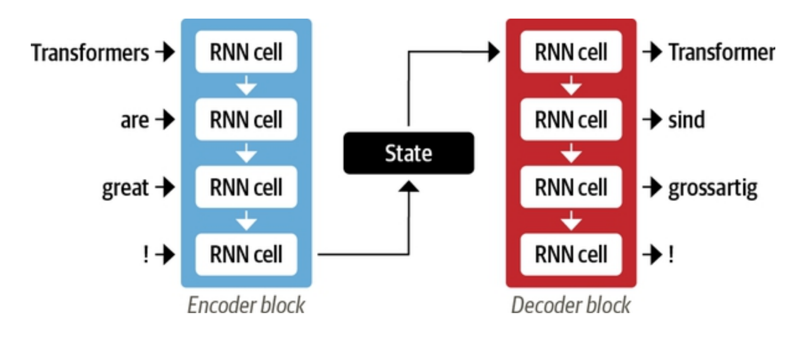
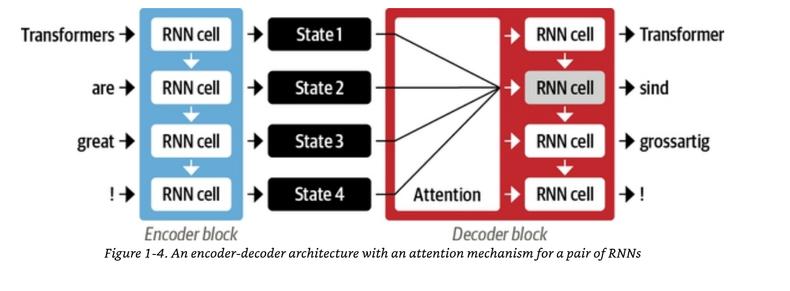

# Hello Transformers

## Encoder Decoder Framework

The encoder-decoder framework is a neural network architecture commonly used for sequence-to-sequence tasks like translation and summarization. The encoder processes the input sequence, compressing it into a fixed-length representation (context vector) that captures its essential information. The decoder takes this context vector and generates the output sequence, one element at a time. Attention mechanisms are often added to improve performance by dynamically focusing on different parts of the input. This framework is widely employed in natural language processing (NLP) and other tasks requiring input-output mapping.

## Attention Mechanism in Encoder-Decoder(RNNs) Framework

The attention mechanism in an encoder-decoder framework allows the decoder to focus on specific parts of the input sequence while generating each output token. Instead of relying solely on the encoder's final hidden state, it computes a weighted sum of all encoder hidden states, where the weights indicate the relevance of each input token to the current decoding step. These weights are learned dynamically based on the decoder's state and the encoder outputs. This approach helps capture long-range dependencies and improves performance on tasks like translation or summarization. Attention thus enhances flexibility and context awareness in sequence-to-sequence models.

## Encoder-Decoder in Transformer

The Encoder-Decoder architecture in transformers is designed for sequence-to-sequence tasks like machine translation. The encoder processes the input sequence, converting it into a set of context-aware representations. The decoder then generates the output sequence based on these representations, one element at a time. Attention mechanisms allow the decoder to focus on relevant parts of the input sequence for each output token. This structure helps the model handle varying input and output lengths effectively, ensuring flexible and accurate predictions.

.png)

## Transfer learning in NLP

Transfer learning in Natural Language Processing (NLP) refers to leveraging a pre-trained model on a large dataset and fine-tuning it on a smaller, domain-specific dataset to improve performance on a particular task. This approach saves time, resources, and computational costs while also improving the accuracy of models, especially when data is scarce.

GPT (Generative Pretrained Transformer) is a language model developed by OpenAI. Transfer learning with GPT typically works in the following way:

### Pretraining Phase(GPT):
GPT is pre-trained on a large and diverse corpus of text (like books, articles, and websites). It learns to predict the next word in a sentence, which allows it to understand grammar, syntax, and a broad understanding of language. This step is unsupervised, and GPT learns from vast amounts of general data.
### Fine-tuning Phase(GPT):
After the pretraining, GPT can be fine-tuned for specific tasks (e.g., text classification, sentiment analysis, summarization) by training it on smaller, task-specific datasets. During fine-tuning, the model adjusts its weights based on the target task, while retaining the knowledge it gained from the pretraining phase.
### Benefits(GPT):
Scalability: Since GPT is already pretrained, only task-specific data is needed for fine-tuning.
Generalization: Pretraining on a broad range of topics enables GPT to generalize well to different types of tasks.
BERT (Bidirectional Encoder Representations from Transformers)
BERT is another transformer-based model by Google that takes a different approach, particularly its bidirectional nature, where GPT only processes text in one direction (left to right), BERT processes text in both directions (left to right and right to left). This allows BERT to understand the context of a word more comprehensively.

### Pretraining Phase(BERT):

BERT is trained on large corpora of text using two tasks: Masked Language Modeling (MLM) and Next 
Sentence Prediction (NSP).
MLM involves randomly masking some words in a sentence and training the model to predict the masked word using the surrounding context.
NSP helps the model learn the relationship between sentences.
### Fine-tuning Phase(BERT):
After pretraining, BERT is fine-tuned for specific NLP tasks such as question answering, named entity recognition (NER), or sentiment analysis. Fine-tuning uses task-specific labeled datasets to adjust the model’s weights for optimal performance.
### Benefits(BERT):
Bidirectional Context: BERT's bidirectional architecture allows it to capture richer context for each word, improving task-specific performance, especially for tasks that require understanding the relationship between words or sentences.
Pretraining on a Variety of Tasks: BERT's pretraining objectives (MLM and NSP) help it perform well on a wide range of tasks.

Key Differences Between GPT and BERT in Transfer Learning
Training Objective:
GPT: Trained as a language model with a causal (unidirectional) approach, predicting the next token in a sequence.
BERT: Trained as a masked language model with a bidirectional context, considering both past and future context in predicting words.
Use Case:

GPT is mainly used for generative tasks (e.g., text generation, completion).
BERT is better suited for discriminative tasks (e.g., text classification, named entity recognition).
Architecture:

GPT uses a decoder-only architecture (left-to-right).
BERT uses an encoder-only architecture (bidirectional)

